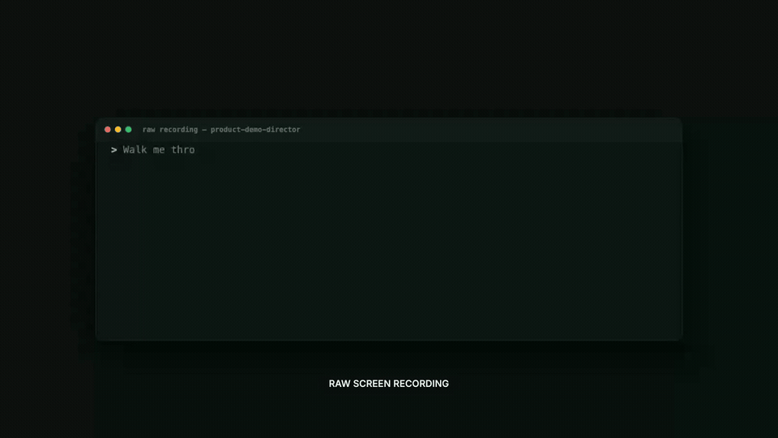

# Product Demo Director

[](https://github.com/crimeacs/product-demo-director/actions/workflows/ci.yml)
[](LICENSE)
[](https://github.com/crimeacs/product-demo-director/stargazers)
[](SKILL.md)

**Give Claude Code or Codex product evidence and footage. Product Demo Director turns them into a
source-bound announcement film, locks every cut between complete spoken thoughts, and proves the
exact file that ships.**

Most product demos are either a flat screen recording nobody finishes or a polished presentation
that no longer feels like a live product. Product Demo Director gives an agent a real production
workflow: inspect the evidence, find the change, write the story, capture missing states, perform the
narration, direct a full-frame edit, render, finish, and verify the delivery.

It's a [Claude Code](https://claude.com/claude-code) skill (see [`SKILL.md`](./SKILL.md)) and a
standalone pipeline — drive it by hand or hand the whole loop to an agent.

[](https://github.com/crimeacs/product-demo-director/releases/latest)

### Why it is different

- **The agent directs a story, not a screen recording.** It finds the change, captures only the
  states that matter, and uses full-frame cuts and connected zooms to control attention.
- **Speech controls picture.** ElevenLabs character timing gives each narrated thought its own
  visual runway; cuts land between ideas instead of clipping them.
- **The shipped file carries receipts.** Source and claim hashes, exact frames, final-media decode,
  loudness, black/silence checks, and narration continuity are bound to the delivery artifact.

The [one-minute repository announcement](examples/save-the-cat/README.md) is made by the repository
itself. A clearly labeled, reproducible workbench replay shows Codex driving the pipeline; the final
film and its release asset remain bound to the exact sources, story, narration timing, frame plan,
and QA receipt used to create them.

## How it works

```
   product.json + a URL
        │
        ▼
   onboard.py  auto-extract the brand (palette/font/logo) → brand.json  (themes the whole engine)
   shoot.py    the director records the footage itself — a web app and/or a terminal/CLI session
   script.py   drafts a launch-film, Save-the-Cat, causal-workflow, or walkthrough script
   preflight.py validates the production contract before render
        │
        ▼
script.json + footage
        │
        ▼
   vo.py     aligned announcement narration — ElevenLabs; non-auto-paced VO may use Gemini TTS
   pace.py   uses ElevenLabs character timing to move picture cuts between complete spoken thoughts
   music.py  an instrumental bed sized to the runtime — ElevenLabs Music or Lyria 3 (auto by key)
   sfx.py    bespoke SFX palette — 3 variants/cue, a model listens and keeps the best
        │
        ▼
   build.py  →  Remotion engine (Timeline.tsx)
        │       full-frame shots · connected zooms · kinetic captions · SFX on real beats
        ▼
   out/demo.mp4 + build-plan.json + artifact.json
        │
        ▼
   finish.py optional two-pass -18 LUFS + BT.709 web-safe delivery master, frame-preserving
        │
        ▼
   qa.py     exact artifact/hash/frame/decode/audio/black/silence QA + proof sheets
        │
        ▼
   judge.py  Gemini watches AND hears the bound cut through story/truth/visual/buyer lenses
        │       pinned model · temperature 0 · median runs · weakest lens remains visible
        ▼
   compare.py requires candidate QA + artifacts, reverses display order, ships only a 2–0 sweep
        └──▶ feed proven fixes back; retain the champion on a split or noise-level change
```

## Quickstart

Requirements: Python 3.10+, Node.js 18+, npm, and FFmpeg.

```sh
git clone https://github.com/crimeacs/product-demo-director.git
cd product-demo-director

./pdd install-skill         # install for Codex and Claude Code
./pdd setup                 # add --with-capture to install Playwright Chromium
cp .env.example .env        # add ElevenLabs for announcement narration alignment
./pdd doctor
./pdd new projects/my-demo --name "My Product"
# Add product.mp4, then tune narrationMap and shot in-points for your product:
./pdd demo projects/my-demo # narrate → pace → render → finish → deterministic QA
```

`install-skill` safely links this checkout into
`~/.agents/skills/product-demo-director` (Codex) and
`~/.claude/skills/product-demo-director` (Claude Code), so future pulls update both automatically.
Use `./pdd install-skill --target codex` or `--target claude` to install only one. Re-running the
same command is safe; an unrelated existing file, directory, or symlink is never overwritten.
Restart an agent app that was already open, then ask it to use Product Demo Director for your repo.

Add `--judge` to `./pdd demo` for the optional AI taste review. The deterministic preflight and QA
gates always run; the judge never replaces them.

`pdd new` starts with a 60-second single-focus announcement contract. Save-the-Cat beats remain
invisible metadata grouped across nine full-frame sequences. Narration thoughts are authored once
in `narrationMap`; ElevenLabs returns exact character timing and `pace.py` moves cuts into the gaps
between thoughts before render. These new announcement projects require `ELEVENLABS_API_KEY`;
`vo.py` stops before synthesis with a clear error if only Gemini is configured. Gemini remains
available for legacy or explicitly non-auto-paced narration, Lyria music, and the optional judge.

Generated videos are ignored by Git by default, including everything under `artifacts/`, every
project's `out/` directory, and the local `projects/` workspace. The only committed video is the
small, deliberately broken calibration fixture used by `judge.py --probe`. Generated sound
palettes stay local too. Force-add media only when it is an intentional, documented public fixture.

### Manual pipeline

The friendly CLI is only orchestration. Every stage remains directly callable when you need precise
control:

```sh
# Optional if you prefer shell variables over the .env file loaded by ./pdd.
export ELEVENLABS_API_KEY=...      # required for auto-paced narration-map alignment
export GEMINI_API_KEY=...          # non-auto-paced Gemini TTS + Lyria music + optional judge

.venv/bin/python tools/vo.py    --project projects/my-demo
.venv/bin/python tools/pace.py  --project projects/my-demo --write # when autoPaceNarration is enabled
.venv/bin/python tools/music.py --project projects/my-demo
.venv/bin/python tools/sfx.py                                 # (optional) regenerate the sound palette
.venv/bin/python tools/build.py --project projects/my-demo      # -> projects/my-demo/out/demo.mp4
.venv/bin/python tools/finish.py --input projects/my-demo/out/demo.mp4 \
  --out projects/my-demo/out/demo-final.mp4 --require-artifact
.venv/bin/python tools/qa.py --video projects/my-demo/out/demo-final.mp4 --project projects/my-demo --require-artifact --strict
.venv/bin/python tools/judge.py --video projects/my-demo/out/demo-final.mp4 --require-artifact --fps 4
```

Draft a compact dramatic product story directly:

```sh
.venv/bin/python tools/script.py --project projects/my-demo --format save-the-cat --seconds 60
.venv/bin/python tools/script.py --project projects/my-demo --format launch-film --seconds 60
```

Bring your own footage: drop clips in `projects/<your-project>/assets/`, write a `script.json`
(schema below), and point the tools at `--project projects/<your-project>`. Capture footage from
a live app with `tools/capture.py`.

For a three-minute causal investor/YC demo:

```sh
.venv/bin/python tools/script.py --project projects/my-demo --format causal-workflow --seconds 175
.venv/bin/python tools/preflight.py --project projects/my-demo --profile yc_3m --strict
.venv/bin/python tools/build.py --project projects/my-demo --profile yc_3m --contracts strict
.venv/bin/python tools/finish.py --input projects/my-demo/out/demo.mp4 \
  --out projects/my-demo/out/demo-final.mp4 --require-artifact
.venv/bin/python tools/qa.py --video projects/my-demo/out/demo-final.mp4 \
  --project projects/my-demo --require-artifact --strict
.venv/bin/python tools/judge.py --video projects/my-demo/out/demo-final.mp4 \
  --require-artifact --all-lenses --runs 1 --fps 6
```

See [`docs/PRODUCTION_CONTRACT.md`](./docs/PRODUCTION_CONTRACT.md) for profiles, global human
narration, claims, continuity, cursor safety, and deterministic shipping gates.

## The script

A `script.json` is a list of shots, each one of `title | clip | stat | cta | score | bars | strip`.
`split` remains available only for an explicitly opted-in legacy comparison; the announcement
profile rejects it so dense product UI stays readable.

```json
{
  "fps": 30,
  "production": { "profile": "announcement", "singleFocus": true },
  "music": "calm confident minimal corporate underscore, soft pulse, no drums",
  "brand": { "name": "Product Demo ", "accent": "Director" },
  "shots": [
    { "n": 1, "kind": "clip", "src": "product.mp4", "continuityId": "product", "stateId": "problem", "durSec": 7 },
    { "n": 2, "kind": "clip", "src": "product.mp4", "continuityId": "product", "stateId": "change", "transitionReason": "the product advances", "durSec": 8,
      "zooms": [{ "atSec": 1, "durSec": 5, "scale": 1.25, "focusX": 60, "focusY": 45 }] },
    { "n": 3, "kind": "clip", "src": "product.mp4", "continuityId": "product", "stateId": "proof", "transitionReason": "the result is verified", "durSec": 8 },
    { "n": 4, "kind": "cta", "title": "Ship the story.", "durSec": 4 }
  ]
}
```

Add `"accent": "success_chime"` (or `click` / `data_tick` / `confirm_cash` / `pivot_boom`) to a
shot to fire that sound exactly on its beat. When a shot has `vo`, the on-screen caption defaults
to that exact line; captions may be suppressed when they would cover a dense live-product surface.
`flash: true` (or `chapter: "AFTER"`) is a legacy before/after pivot and is not used by the
single-focus announcement profile. Full schema + knobs (`production`, `narration`, `storyBeat`, `actor`, `actionRisk`,
`continuityId`, `preserveFraming`, `pronounce`, `voice_settings`, `split`, in-points) are in
[`SKILL.md`](./SKILL.md).

## Repository layout

| Path | What |
|---|---|
| `engine/` | Self-contained Remotion project — the props-driven motion engine (`src/Timeline.tsx`), themed per project via `brand.json`. |
| `tools/onboard.py` | Auto-extract a brand (palette/font/logo/name) from the product's URL → `brand.json`. |
| `tools/shoot.py` | The director records footage itself — autonomous web shoots + terminal/CLI sessions. |
| `tools/term.py` | Render a terminal / agent session as footage (for CLIs and Claude skills). |
| `tools/workbench.py` | Render a JSON-driven Claude/Codex production workbench with prompt, tools, previews, timeline, render, and QA states. |
| `tools/script.py` | Draft a Save-the-Cat, causal-workflow, before-after, or walkthrough `script.json` from the product, brand, and footage manifest. |
| `tools/preflight.py` | Deterministic source/story/claim/audio/camera checks before render. |
| `tools/vo.py` | ElevenLabs `eleven_v3` or Gemini TTS, as per-shot lines or one continuous generated narration master; supplied human masters are staged by `build.py`. |
| `tools/pace.py` | Retimes picture boundaries to timestamp-aligned narration gaps without accelerating or truncating speech. |
| `tools/music.py` | ElevenLabs Music or Lyria bed, sized to the narrated runtime. |
| `tools/sfx.py` | Forge a bespoke SFX palette; a model listens and keeps the best of each. |
| `tools/build.py` | Maps the contract and script to exact-frame Remotion props, render, build plan, and artifact manifest. |
| `tools/finish.py` | Frame-preserving, two-pass loudness and BT.709/yuv420p delivery master with inherited provenance. |
| `tools/qa.py` | Binds and decodes the final artifact, measures delivery audio/black/silence, and generates proof sheets. |
| `tools/judge.py` | Gemini video judge for subjective review after deterministic QA. |
| `tools/compare.py` | Artifact-bound, order-reversed champion/candidate gate; a candidate ships only on a 2–0 sweep outside judge noise. |
| `tools/capture.py` | Playwright recorder + page-probe used by `shoot.py`/`term.py`. |
| `docs/EDITING.md` | The edit methodology — every rule was a real mistake first. |
| `docs/PRODUCTION_CONTRACT.md` | Profiles, narration locks, claims, continuity, artifact binding, and acceptance gates. |
| `docs/CAPTURE.md` | Capturing footage cleanly: web (autonomous planning), terminal, redaction. |
| `examples/save-the-cat/` | The reproducible one-minute story of Codex turning raw footage and verified inputs into a directed, QA-proven demo. |
| `examples/calibration/` | Committed known-bad cut for `judge.py --probe` — run it before trusting any improve loop. |

## Craft rules (the short version)

- **Choose a real story grammar.** Use Save the Cat for dramatic transformation, causal workflow
  for consequential proof, before/after for a sourced short promo, or walkthrough for chaptered use.
- **Progress must appear live.** A finished answer visible before its initiating event reads as a preset.
- **Authority is product behavior.** Low-friction work may be automatic; consequential decisions keep the accountable human boundary.
- **Captions are optional; subtitles are exact.** Suppress duplicate text when it obscures the product.
- **Use live takes for causality.** Stills can explain a sourced fact but cannot prove state change.
- **No same-screen crop resets.** One screen/session gets one clip and connected camera regions.
- **Protect people and cursors.** Preserve moving human framing and keep the pointer inside its safe margin.
- **No meta-commentary on screen.** Strip anything that narrates how the cut was made.
- **Pace by meaning.** Remove inert time, not the setup or decision hold that makes the story legible.
- **One visual focus.** Sequence comparisons as full-frame evidence; never cut away in the middle of a spoken thought.
- **Show the work.** Include source evidence, an event/receipt, and one completed packet when claiming scale.
- **Redact identifiers, never the value.** Hide client marks; keep the proof sharp.
- **Be honest.** Only verified claims; show the real human/agent boundary; end once.

Full reasoning in [`docs/EDITING.md`](./docs/EDITING.md).

## Why a judge?

A demo can pass every deterministic check and still be confusing or forgettable. `judge.py` has
Gemini watch and hear the artifact, then comment on story, tempo, motion, VO, proof, and polish.
It is deliberately downstream of `preflight.py` and `qa.py`: a model cannot waive a stale hash,
cropped source, unsupported claim, broken authority boundary, or bad frame count.

Run the improve loop as an experiment: pin the model, use the median of three, compare champion and
candidate in both orders, and ship only a 2–0 winner. Treat a split or roughly two-point movement as
noise. If three plausible in-point/zoom/pacing candidates fail, stop grinding cut mechanics; the
next gain requires narration, product behavior, or fresh footage.

## Community

Contributions are welcome—from focused bug fixes and tests to new capture or editing capabilities.
Read the [contribution guide](./CONTRIBUTING.md) before opening a pull request, and use the structured
issue forms for reproducible bug reports, feature proposals, and usage questions.

By participating, you agree to the [Code of Conduct](./CODE_OF_CONDUCT.md). Report vulnerabilities
privately according to the [security policy](./SECURITY.md), never in a public issue.

## Built with

Motion by [Remotion](https://remotion.dev); voice and music by
[ElevenLabs](https://elevenlabs.io); optional judging by Google Gemini. Repository-owned code is MIT
licensed; Remotion and other dependencies retain their own terms—see
[`THIRD_PARTY_NOTICES.md`](./THIRD_PARTY_NOTICES.md).
