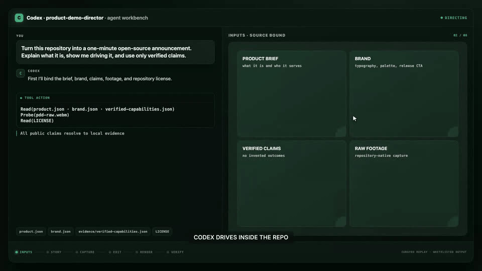
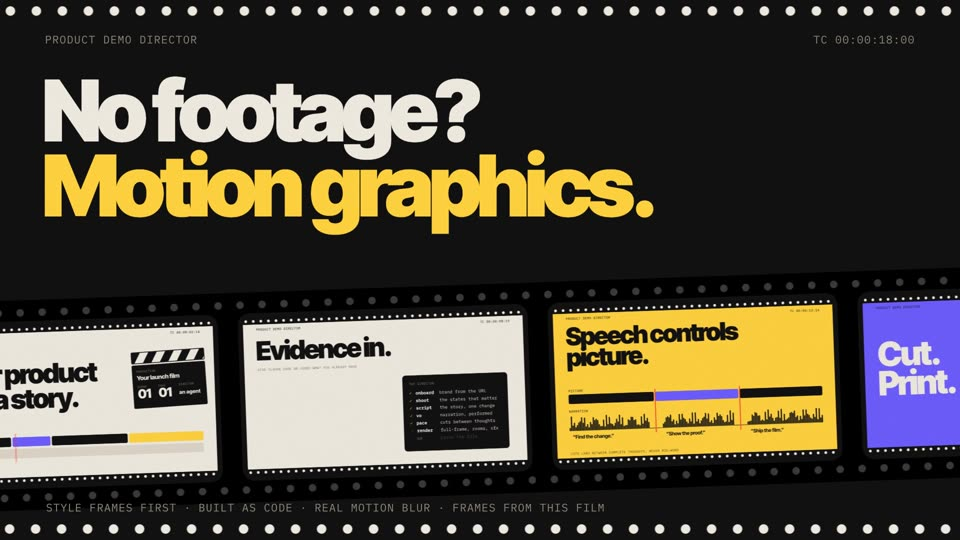

<h1 align="center">Product Demo Director</h1>

<p align="center"><b>Your agent directs your product film.</b><br>
Hand Claude Code or Codex your product. Get back a launch film that's directed, scored, and checked frame by frame.</p>

<p align="center">
<a href="https://github.com/crimeacs/product-demo-director/actions/workflows/ci.yml"></a>
<a href="LICENSE"></a>
<a href="SKILL.md"></a>
<a href="https://github.com/crimeacs/product-demo-director/stargazers"></a>
</p>

[](examples/motion-pdd-self/README.md)

<p align="center"><sub>This repository's own film, made by the repository. <a href="examples/motion-pdd-self/README.md">How it was made →</a></sub></p>

---

## Start in 60 seconds

Needs Python 3.10+, Node.js 18+ and FFmpeg.

```sh
git clone https://github.com/crimeacs/product-demo-director.git && cd product-demo-director
./pdd install-skill     # links the skill into Claude Code and Codex
./pdd setup             # Python + Remotion dependencies (add --with-capture for Playwright)
cp .env.example .env    # add ELEVENLABS_API_KEY (voice, music, sound); GEMINI_API_KEY is optional
./pdd doctor            # checks tools, keys and disk
```

Restart your agent, open your product's repo, and just ask:

> *Use Product Demo Director to make a 60-second launch film for this repo. Only use claims you can verify.*

> *Use Product Demo Director's motion-graphics track to make a 30-second ad for our product. Show me style frames first.*

The agent reads the playbook in [`SKILL.md`](SKILL.md), does the work, and hands you a finished,
QA-checked file.

## Two ways to make a film

|  | **Product film** | **Motion-graphics film** |
|---|---|---|
| **Best for** | Launches, feature announcements, investor demos | Brand spots, launch ads, social cuts |
| **Picture** | Real footage the director shoots itself: your web app or a terminal session | Designed scenes built as code. No footage, no screenshots |
| **Sound** | Performed narration, a scored bed, SFX on real beats | A custom score and a sound palette made for this film |
| **Signature move** | Cuts land between spoken thoughts, never mid-word | Style frames first, then frame-exact renders with real motion blur |
| **Run it** | `./pdd new` → `./pdd demo` | `python tools/motion.py all <project>` |
| **Playbook** | [`SKILL.md`](SKILL.md) · [`docs/EDITING.md`](docs/EDITING.md) | [`docs/MOTION_GRAPHICS.md`](docs/MOTION_GRAPHICS.md) |

## Made with it

<table>
<tr>
<td width="50%"><a href="examples/save-the-cat/README.md"></a><br><b>The one-minute announcement</b><br><sub>Product film · Codex turns raw footage and verified inputs into a directed demo</sub></td>
<td width="50%"><a href="examples/motion-pdd-self/README.md"></a><br><b>"Evidence in. A directed film out."</b><br><sub>Motion graphics · this repository's own film, in the cutting-room direction</sub></td>
</tr>
</table>

Every example folder holds the full source (film, cue sheet, settings, style frames), so you can
re-render it or copy its approach.

## Why it's different

- **It directs a story, not a screen recording.** The agent finds the one change worth showing,
  captures only the states that matter, and controls attention with full-frame cuts and connected zooms.
- **Speech controls picture.** Character-level timing from ElevenLabs gives every narrated thought its
  own visual runway, so cuts land between ideas instead of clipping them.
- **Designed, not generated.** No AI footage and no stock slop: redrawn product moments, real type, real
  motion design, style frames approved before a single frame renders.
- **The file that ships carries receipts.** Source and claim hashes, exact frames, a full decode,
  loudness, black-frame and silence checks are bound to the delivered file. An optional Gemini judge
  watches and listens, but it can never waive a failed check.

## Drive it yourself

The agent uses the same commands you can run by hand.

```sh
# Product film
./pdd new projects/my-demo --name "My Product"   # starter 60-second announcement project
# add product.mp4 (or let the agent shoot it), tune narrationMap and in-points, then:
./pdd demo projects/my-demo                      # narrate → pace → render → finish → QA
./pdd demo projects/my-demo --judge              # plus the optional AI taste review

# Motion-graphics film
python tools/motion.py new projects/my-ad        # scaffold film.html, cues.json, motion.json
python tools/motion.py styleframes projects/my-ad f=A1 f=B1   # pick a direction first
python tools/motion.py music projects/my-ad      # a score for this film
python tools/motion.py sfx projects/my-ad        # its sound palette
python tools/motion.py all projects/my-ad        # render → mix → QA
```

Generated media stays out of Git: `projects/`, every `out/` folder and `artifacts/` are ignored.

<details>
<summary><b>How the product-film pipeline works</b></summary>

```
   product.json + a URL
        │
        ▼
   onboard.py   auto-extract the brand (palette/font/logo) → brand.json (themes the whole engine)
   shoot.py     the director records the footage itself: a web app and/or a terminal/CLI session
   script.py    drafts a launch-film, Save-the-Cat, causal-workflow, or walkthrough script
   preflight.py validates the production contract before render
        │
        ▼
   script.json + footage
        │
        ▼
   vo.py     announcement narration: ElevenLabs; non-auto-paced VO may use Gemini TTS
   pace.py   uses ElevenLabs character timing to move picture cuts between complete spoken thoughts
   music.py  an instrumental bed sized to the runtime: ElevenLabs music_v2 (optionally timed to the cuts) or Lyria 3.5
   sfx.py    bespoke SFX palette: 3 variants per cue, a model listens and keeps the best
        │
        ▼
   build.py  →  Remotion engine (Timeline.tsx)
        │       full-frame shots · connected zooms · kinetic captions · SFX on real beats
        ▼
   out/demo.mp4 + build-plan.json + artifact.json
        │
        ▼
   finish.py  optional two-pass -18 LUFS + BT.709 web-safe delivery master, frame-preserving
   qa.py      exact artifact/hash/frame/decode/audio/black/silence QA + proof sheets
   judge.py   Gemini watches AND hears the bound cut through story/truth/visual/buyer lenses
   compare.py order-reversed champion/candidate gate; a candidate ships only on a 2–0 sweep
```

`pdd new` starts a 60-second single-focus announcement. Narration thoughts are written once in
`narrationMap`; ElevenLabs returns exact character timing and `pace.py` moves cuts into the gaps
between thoughts before render. These projects require `ELEVENLABS_API_KEY`; `vo.py` stops with a clear
error if only Gemini is configured. Gemini remains available for non-auto-paced narration, Lyria music
and the judge.

</details>

<details>
<summary><b>Every stage by hand</b></summary>

`./pdd` is only orchestration; every stage stays directly callable.

```sh
export ELEVENLABS_API_KEY=...   # or put it in .env, which ./pdd loads
export GEMINI_API_KEY=...       # optional: non-auto-paced TTS, Lyria music, judge

.venv/bin/python tools/vo.py    --project projects/my-demo
.venv/bin/python tools/pace.py  --project projects/my-demo --write   # when autoPaceNarration is on
.venv/bin/python tools/music.py --project projects/my-demo
.venv/bin/python tools/sfx.py                                        # optional: regenerate the palette
.venv/bin/python tools/preflight.py --project projects/my-demo --strict
.venv/bin/python tools/build.py --project projects/my-demo --contracts strict
.venv/bin/python tools/finish.py --input projects/my-demo/out/demo.mp4 \
  --out projects/my-demo/out/demo-final.mp4 --require-artifact
.venv/bin/python tools/qa.py --video projects/my-demo/out/demo-final.mp4 --project projects/my-demo --require-artifact --strict
.venv/bin/python tools/judge.py --video projects/my-demo/out/demo-final.mp4 --require-artifact --fps 4
```

Draft a story:

```sh
.venv/bin/python tools/script.py --project projects/my-demo --format save-the-cat --seconds 60
.venv/bin/python tools/script.py --project projects/my-demo --format launch-film --seconds 60
```

A three-minute causal investor/YC demo:

```sh
.venv/bin/python tools/script.py --project projects/my-demo --format causal-workflow --seconds 175
.venv/bin/python tools/preflight.py --project projects/my-demo --profile yc_3m --strict
.venv/bin/python tools/build.py --project projects/my-demo --profile yc_3m --contracts strict
.venv/bin/python tools/finish.py --input projects/my-demo/out/demo.mp4 \
  --out projects/my-demo/out/demo-final.mp4 --require-artifact
.venv/bin/python tools/qa.py --video projects/my-demo/out/demo-final.mp4 \
  --project projects/my-demo --require-artifact --strict
.venv/bin/python tools/judge.py --video projects/my-demo/out/demo-final.mp4 \
  --require-artifact --all-lenses --runs 1 --fps 6
```

Bring your own footage: drop clips in `projects/<name>/assets/`, write a `script.json` and point the
tools at `--project projects/<name>`. Capture a live app with `tools/capture.py`. Profiles, narration
locks, claims, continuity, cursor safety and shipping gates are in
[`docs/PRODUCTION_CONTRACT.md`](docs/PRODUCTION_CONTRACT.md).

</details>

<details>
<summary><b>The script format</b></summary>

A `script.json` is a list of shots, each one of `title | clip | stat | cta | score | bars | strip`.
`split` is available only as an explicitly opted-in legacy comparison; the announcement profile
rejects it so dense product UI stays readable.

```json
{
  "fps": 30,
  "production": { "profile": "announcement", "singleFocus": true },
  "music": "calm confident minimal corporate underscore, soft pulse, no drums",
  "brand": { "name": "Product Demo ", "accent": "Director" },
  "shots": [
    { "n": 1, "kind": "clip", "src": "product.mp4", "continuityId": "product", "stateId": "problem", "durSec": 7 },
    { "n": 2, "kind": "clip", "src": "product.mp4", "continuityId": "product", "stateId": "change", "transitionReason": "the product advances", "durSec": 8,
      "zooms": [{ "atSec": 1, "durSec": 5, "scale": 1.25, "focusX": 60, "focusY": 45 }] },
    { "n": 3, "kind": "clip", "src": "product.mp4", "continuityId": "product", "stateId": "proof", "transitionReason": "the result is verified", "durSec": 8 },
    { "n": 4, "kind": "cta", "title": "Ship the story.", "durSec": 4 }
  ]
}
```

Add `"accent": "success_chime"` (or `click` / `data_tick` / `confirm_cash` / `pivot_boom`) to fire
that sound exactly on a shot's beat. A shot's `vo` line becomes its caption by default; captions may be
suppressed when they would cover a dense product surface. The full schema (`production`, `narration`,
`storyBeat`, `actor`, `actionRisk`, `continuityId`, `preserveFraming`, `pronounce`, `voice_settings`,
in-points) is in [`SKILL.md`](SKILL.md).

</details>

<details>
<summary><b>Craft rules, the short version</b></summary>

- **Choose a real story grammar.** Save the Cat for transformation, causal workflow for consequential
  proof, before/after for a sourced promo, walkthrough for chaptered use.
- **Progress must appear live.** A finished answer visible before its trigger reads as a preset.
- **Authority is product behavior.** Low-friction work may be automatic; consequential decisions keep the accountable human.
- **Captions are optional; subtitles are exact.**
- **Use live takes for causality.** Stills explain a sourced fact but cannot prove a state change.
- **No same-screen crop resets.** One screen gets one clip and connected camera moves.
- **Protect people and cursors.** Keep human framing and the pointer inside its safe margin.
- **No meta-commentary on screen.**
- **Pace by meaning.** Cut inert time, not the setup or decision hold that makes the story legible.
- **One visual focus.** Never cut away in the middle of a spoken thought.
- **Show the work.** Source evidence, a receipt, and one completed packet when claiming scale.
- **Redact identifiers, never the value.**
- **Be honest.** Only verified claims; show the real human/agent boundary; end once.

For motion graphics: one idea per screen, hits snap and flows glide, hold then hit, confident colour,
designed transitions, sound on every hit. Full reasoning in [`docs/EDITING.md`](docs/EDITING.md) and
[`docs/MOTION_GRAPHICS.md`](docs/MOTION_GRAPHICS.md).

</details>

<details>
<summary><b>Why an AI judge, and why it can't overrule QA</b></summary>

A demo can pass every deterministic check and still be confusing or forgettable. `judge.py` has Gemini
watch and hear the file, then comment on story, tempo, motion, voice, proof and polish. It runs after
`preflight.py` and `qa.py`, so a model can never waive a stale hash, a cropped source, an unsupported
claim or a bad frame count.

Run the improve loop as an experiment: pin the model, take the median of three, compare champion and
candidate in both orders, and ship only a 2–0 winner. A split or a roughly two-point move is noise. If
three plausible cut-level candidates fail, stop grinding; the next gain needs new narration, product
behavior or footage. Calibrate first with the known-bad cut in `examples/calibration/`.

</details>

<details>
<summary><b>Repository layout</b></summary>

| Path | What |
|---|---|
| `engine/` | The Remotion project: the props-driven motion engine (`src/Timeline.tsx`), themed per project by `brand.json` |
| `motion/` | Motion-graphics kit (`kit.js`), starter film and bundled OFL fonts |
| `tools/motion.py` · `tools/motion_render.mjs` | Motion-graphics films: style frames, music, SFX, motion-blurred render, mix, QA |
| `tools/onboard.py` | Extract a brand (palette, font, logo, name) from the product's URL |
| `tools/shoot.py` · `tools/capture.py` | The director records footage itself: autonomous web shoots and terminal sessions |
| `tools/term.py` · `tools/workbench.py` | Render terminal or agent sessions, and a Claude/Codex production workbench, as footage |
| `tools/script.py` | Draft a Save-the-Cat, causal-workflow, before/after or walkthrough script |
| `tools/preflight.py` | Deterministic source, story, claim, audio and camera checks before render |
| `tools/vo.py` · `tools/pace.py` | Narration (ElevenLabs `eleven_v3` or Gemini TTS) and cuts retimed to its gaps |
| `tools/music.py` · `tools/sfx.py` | Score and sound palette |
| `tools/build.py` · `tools/finish.py` | Frame-exact render with an artifact manifest; loudness-normalised delivery master |
| `tools/qa.py` · `tools/judge.py` · `tools/compare.py` | Bound QA and proof sheets, the Gemini judge, and the champion/candidate gate |
| `docs/` | `EDITING.md`, `MOTION_GRAPHICS.md`, `PRODUCTION_CONTRACT.md`, `CAPTURE.md` |
| `examples/` | The films above, plus the calibration cut for `judge.py --probe` |

When an agent works inside this checkout, Codex reads [`AGENTS.md`](AGENTS.md) and Claude Code reads
[`CLAUDE.md`](CLAUDE.md): workflow, safety boundaries, exact commands and what "done" means.
`./pdd install-skill` links this checkout into `~/.agents/skills/` and `~/.claude/skills/`, so a
`git pull` updates both; `--target codex` or `--target claude` installs one. It never overwrites an
unrelated file.

</details>

## Community

Contributions are welcome, from focused fixes and tests to new capture or editing capabilities. Read
the [contribution guide](CONTRIBUTING.md) first and use the issue forms. By participating you agree to
the [Code of Conduct](CODE_OF_CONDUCT.md). Report vulnerabilities privately per the
[security policy](SECURITY.md), never in a public issue.

Built with [Remotion](https://remotion.dev), [ElevenLabs](https://elevenlabs.io) voice, music and
sound, [Playwright](https://playwright.dev), and optional judging by Google Gemini. Repository code is
MIT licensed; dependencies keep their own terms, see [`THIRD_PARTY_NOTICES.md`](THIRD_PARTY_NOTICES.md).
